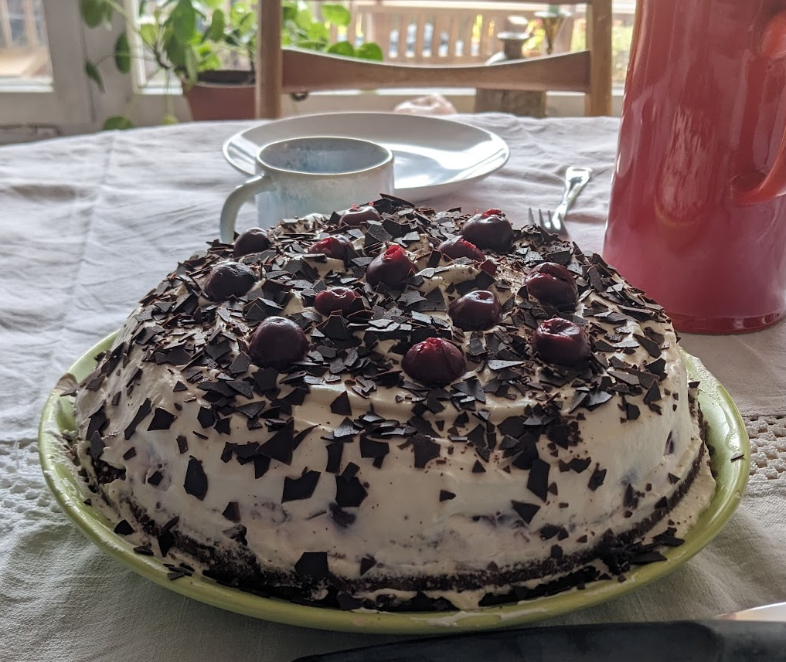

# Chocolate-Cherry Cream Cake on Almond Base  

## Almond Base  
### Ingredients:  
- 80 g butter  
- 80 g sugar  
- 1 packet (8 g) vanilla sugar  
- 5 egg yolks  
- 1 tsp baking powder  
- 100 g grated dark chocolate  
- 200 g ground almonds  
- *(Optional: 1 glass of rum)*  

### Preparation:  
1. Beat the butter until creamy, then gradually add the sugar and vanilla sugar.  
2. Stir in the egg yolks one at a time, then add the baking powder, chocolate, and almonds.  
3. Beat the egg whites until stiff and carefully fold them into the batter.  
4. Pour the batter into a greased springform pan (Ø 26–28 cm).  
5. Bake at 180°C (top/bottom heat) for about 30 minutes.  
6. Let the cake cool completely.  

## Topping  
### Ingredients:  
- 1 jar of cherries  
- 1 heaping tablespoon starch  
- 400 ml heavy cream  
- Dark chocolate sprinkles  

### Preparation:  
1. Thicken the cherries with starch and let them cool completely.  
2. Whip the cream until stiff.  
3. Evenly spread the cherries over the cake base.  
4. Spread the whipped cream on top.  
5. Decorate with chocolate sprinkles and 12 cherries.  

Tip: Let the cake sit in the fridge for a few hours before serving.

