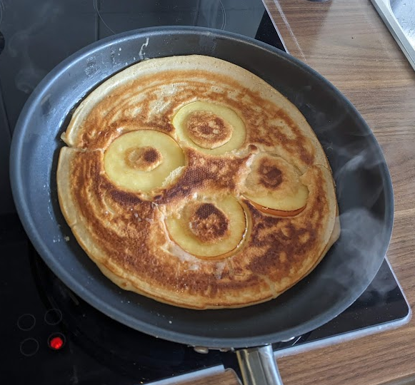

# Geschüttelte Apfel-Pfannkuchen

## Teig
### Zutaten:
- 3 Eier
- 150 g Weizenmehl (Type 1050)
- 300 ml Milch
- 1 TL Backpulver
- Eine Prise Salz

### Zubereitung:
1. Alle Zutaten in einen Protein-Shaker geben
2. Deckel fest verschließen und kräftig schütteln bis alles gut vermischt ist (~1 min)
3. 5-10 Minuten ruhen lassen

## Belag
### Zutaten:
- 1 Apfel, vorzugsweise Boskoop
- Zimt und Zucker

## Zubereitung:
1. Apfel entkernen und in 4 mm dicke Scheiben schneiden
2. Etwas Sonnenblumenöl in eine beschichtete Pfanne geben und erhitzen (mittlere Hitze)
3. Zuerst die Apfelscheiben in die Pfanne geben. Auf einer Seite bräunen lassen und wenden
4. Sofort den Teig aus dem Shaker direkt in die Pfanne gießen, sodass die Äpfel bedeckt sind
5. Backen bis sich Blasen an der Oberfläche bilden (ca. 2-3 Minuten)
6. Wenden und die andere Seite goldbraun backen (1-2 Minuten)
7. Mit Zimt und Zucker bestreuen. Voilà!

> Tipp: Pfannkuchen sollten frisch gegessen werden, direkt von der Pfanne auf den Teller.

## Danksagung
> Keine

