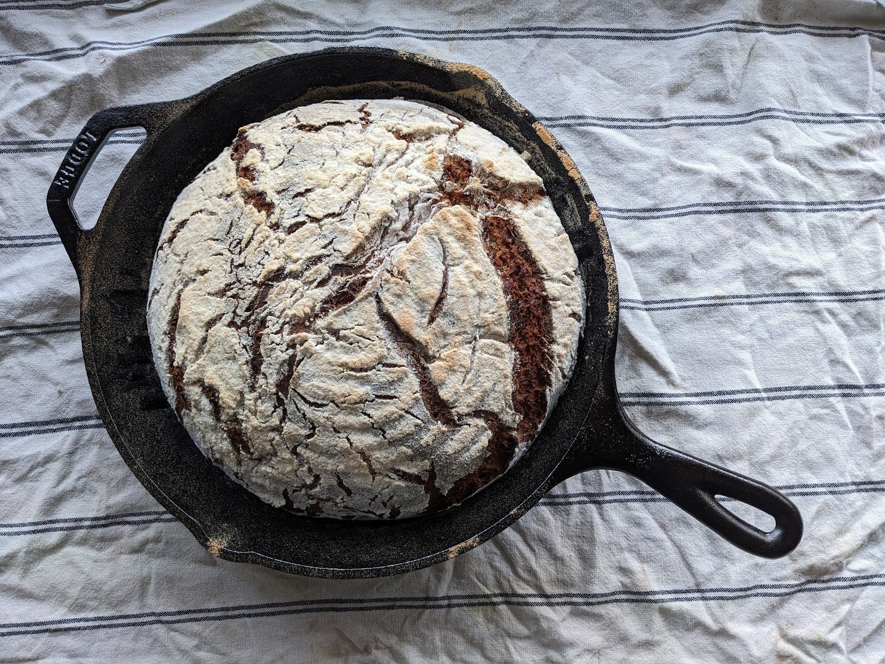

# Einfaches Hausbrot in der Gusseisernen Pfanne

## Zutaten
### Teig:
- 500 g Roggenmehl Vollkorn  
- 450 mL Wasser (handwarm)  
- 50 g Sauerteigkultur  
- 10 g Salz  

## Zubehör
- Schüssel mit Deckel  
- Gärkörbchen  
- Gusseiserne Pfanne  
- Gummifotze  

## Tag 1 – Der Sauerteig
### Zubereitung:
1. Mehl in Schüssel abwiegen  
2. Handwarmes Wasser zugeben  
3. Salz angeben  
4. Mit Gummifotze zu einem Teig verrühren  
5. Teigtemperatur prüfen (< 35 °C)  
6. Sauerteig unterrühren  
7. Teig abdecken (feucht halten) und 12–24 h bei Raumtemperatur inkubieren  

## Tag 2 – Formen und Backen
### Vorbereitung:
1. Prüfen: Teig riecht sauer und hat Blasen → Sauerteig aktiv  
2. 50 g für nächste Kultur abnehmen → Kühlschrank  

> Optional: Nüsse, Samen oder Kümmel unterrühren  
> Optional: 100–300 g Roggenmehl + gleich viel Wasser zugeben und verrühren

3. 1 h bei Raumtemperatur ruhen lassen  
4. Teig mit Gummifotze rundformen, gut bemehlen  
5. In bemehltes Gärkörbchen legen  
6. 1 h bei Raumtemperatur ruhen lassen & währendessen Backofen inkl. Pfanne auf 250 °C vorheizen  

### Backen:
1. Teig in heiße Pfanne geben
   > Tipp: Sofort etwas heißes Wasser in den Ofen geben (z.B. auf heißes Backblech)
   > → Wasserdampf sorgt für knackige Brotkruste  
2. 10 min bei 250 °C backen  
3. Weitere 40–50 min bei 210 °C backen  
4. Brot auf einem Gitter auskühlen lassen (mindestens 2 h)

## Acknowledgment
> Shoutout and thanks to [Lutz Geißler](https://www.ploetzblog.de/)

