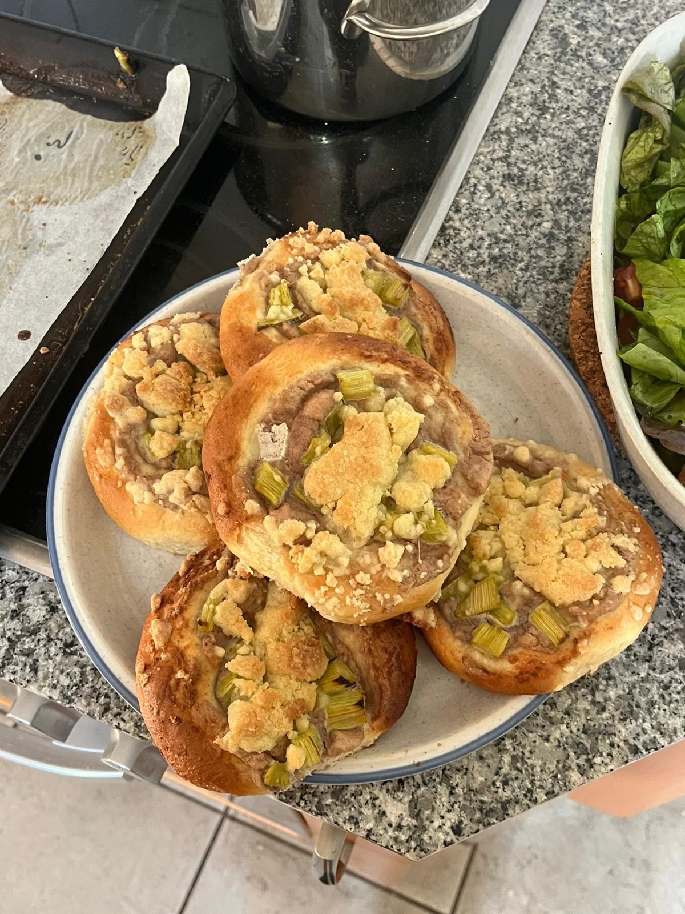

# Vegane Streuseltörtchen (drożdżówki)

## Hefeteig
### Zutaten:
- 750 g Mehl
- 90 g Zucker
- 150 g Butter (vegan), geschmolzen
- 370 g Pflanzenmilch (handwarm)
- 12 g Trockenhefe (oder 42 g Frischhefe)

### Zubereitung:
1. Hefe mit einem Löffel Zucker, etwas warmer Milch und einem Löffel Mehl verrühren und als Vorteig kurz gehen lassen.
2. Butter schmelzen.
3. Alle Zutaten vermengen und kneten, bis der Teig nicht mehr klebt.
4. Abgedeckt ca. 1 Stunde bei Raumtemperatur gehen lassen.

## Nussfüllung
### Zutaten:
- 200 g Cashews (alternativ: Mandeln, Walnüsse o. Ä.)

### Zubereitung:
1. Nüsse kurz kochen, bis sie weich sind.
2. Abgießen und fein pürieren.

## Streusel
### Zutaten:
- 150 g Mehl
- 150 g Puderzucker
- 80 g Butter (vegan), geschmolzen

### Zubereitung:
1. Alle Zutaten vermengen und zu Streuseln verreiben.

## Belag
### Zutaten:
- Rhabarberkompott oder klein geschnittene Äpfel
- Alternativ: Beeren (z. B. Himbeeren, Blaubeeren)
- Etwas Pflanzenmilch und Zucker zum Bestreichen

## Fertigstellung
1. Backofen auf 180 °C (Ober-/Unterhitze) vorheizen.
2. Teig in ca. 90 g schwere Kugeln portionieren.
3. Jede Kugel flach drücken und einen Löffel Nussfüllung in die Mitte geben.
4. Den Rand mit einer Mischung aus Pflanzenmilch und Zucker bestreichen.
5. Obst (Rhabarberkompott, Äpfel oder Beeren) darauf verteilen.
6. Streusel darüber verteilen.
7. Bei 180 °C ca. 20 Minuten backen – immer nur ein Blech gleichzeitig.

## Danksagung
> Shoutout an Karolina für dieses leckere Rezept!

